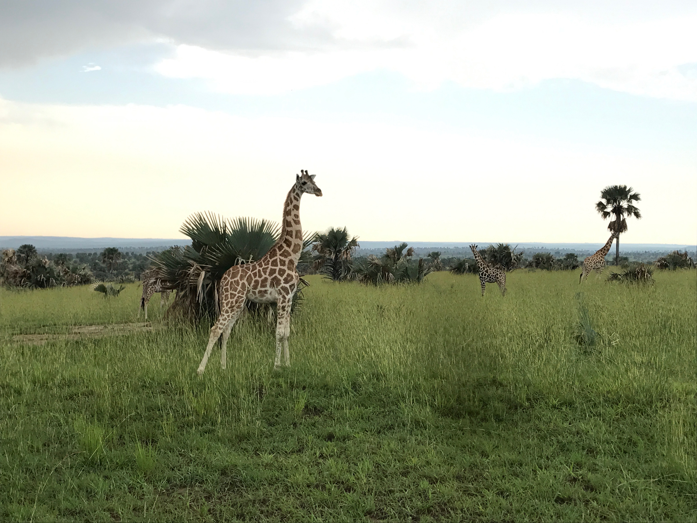

### Education
**Columbia University Mailman School of Public Health, New York, NY**     
Master of Public Health in Epidemiology, Epidemiology of Chronic Disease Certificate (Expected May 2021)

**University of Massachusetts Amherst, Amherst MA** 	
Bachelor of Science in Public Health, Microbiology Minor (May 2018)          

### Relevant Experience
**Disease Control Intern, New York City Department of Health and Mental Hygeine, New York, NY** 
*June 2020 – Present*
* Conduct surveillance of Salmonella and other infections in New York City through patient interviews, questionnaires and data analysis 
* Investigate foodborne disease outbreaks and clusters in New York City, analyze data using SAS and prepare written reports summarizing outbreak and cluster investigation
* Perform hospital and laboratory provider follow ups to verify case contact information and laboratory test results
* Develop and launch REDCap survey for Salmonella Surveillance interviews 

**Health Research Training Program Intern, Healthy Start Brooklyn, Brooklyn NY**     
*Jan – May 2020*
* Helped provide free doula support to pregnant people living in areas with disproportionately high rates of poor birth outcomes in neighborhoods within Brownsville and East New York
* Conducted doula-client interviews and gather and provide 20+ resources to pregnant individuals to address various needs, including mental health support and advocacy

**Lead Teaching Assistant, Columbia University Mailman School of Public Health, New York, NY**  
*August 2020 - Present*
* Assist in course development and content creation, including conversion to online platforms such as Rise Interactive 
* Oversee 10 teaching assistants, and provide administrative, education and technical support for faculty and 400+ first-year MPH students 

**Summer International Health Fellow, FIMRC, Bududa, Uganda**  
*June - July 2017*
* Supported clinical efforts by identifying pneumonia in a patient, carrying out rapid diagnostic tests in lab for malaria, and provided assistance to the mothers in maternal health ward
* Participated in community outreach programs to raise awareness about HIV/AIDS  by visiting homes, hospitals and clinics 
*	Successfully led the development of a Hypertension Support Club with a yearlong plan to raise awareness and help 25+ patients manage symptoms

### Skills
**Languages**
Fluent in Nepali and Hindi, beginner in Spanish

**Computer Skills**
Microsoft Office, SAS, beginner in R and QGIS

### Fun Facts
* My favorite and the most memorable experience I have had is going on a safari in Uganda and seeing the big 5 up close. 
* My favorite dessert is cheesecake. 
* A new skill I would like to learn is to knit! 

Here is a picture I took during the safari: 

